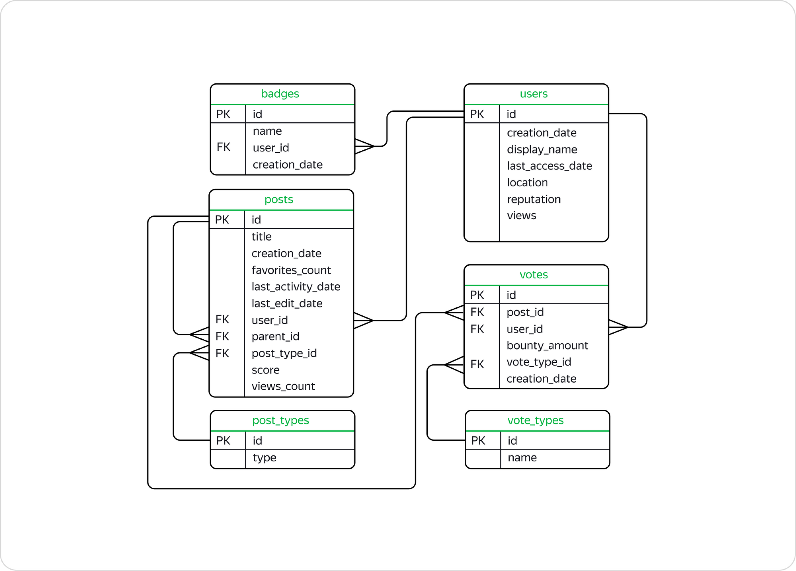

# 🗃️ Stack Overflow SQL Analytics

This project presents an exploratory analysis of Stack Overflow data using **PostgreSQL**, focusing on user activity, content performance, engagement patterns, and temporal trends.

The analysis is based on a relational database containing information about users, posts, votes, badges, and content types. The project consists of **20 analytical SQL queries**, ranging from basic aggregations and joins to CTEs, ranking, cumulative calculations, and advanced window functions.

➡️ **[Open the complete SQL analysis notebook](stack_overflow_sql_analytics.ipynb)**

## 🎯 Project Overview

The objective of this project is to analyze user behavior and platform activity while demonstrating practical SQL skills commonly required in Data Analyst roles.

The analysis covers several areas:

- platform activity and user registration;
- user engagement and contribution patterns;
- content performance;
- voting and community moderation;
- monthly activity trends;
- user segmentation and ranking;
- cumulative and time-based analysis.

Each analysis includes the **SQL query, query output, and interpretation of the results**, connecting technical SQL implementation with analytical reasoning.

## 🗄️ Database

The project uses a relational Stack Overflow database containing platform activity data, primarily covering **2008**.

The database consists of six interconnected tables:

| Table | Description |
|---|---|
| `users` | User profiles, registration dates, reputation, location, and profile views |
| `posts` | Questions and answers, including scores, views, favorites, and publication dates |
| `votes` | Votes assigned to posts by users |
| `badges` | Badges awarded to users for platform achievements |
| `post_types` | Classification of posts as questions or answers |
| `vote_types` | Types of votes, including UpMod, DownMod, Close, Spam, and others |

The relational structure enables analysis across user behavior, content creation, voting activity, community recognition, and platform engagement.

### Database Schema

The main relationships connect users with their posts, votes, and badges, while lookup tables describe post and vote types.

## 🔍 Analysis

The project is structured into six analytical areas, progressing from general platform exploration to more advanced SQL analysis.

### 📊 Platform Overview
Explores overall platform activity, including popular questions, daily question volume, and early user engagement through badge acquisition.

### 👤 User Analytics
Analyzes user behavior and characteristics through voting activity, badge rankings, profile-view segmentation, registration growth, and time to first contribution.

### 📝 Content Analysis
Examines post performance by comparing individual post scores with author-level averages and analyzing content created by highly recognized users.

### 📈 Time Series Analysis
Investigates temporal patterns in platform activity, including monthly post views, posting behavior of selected user cohorts, and month-over-month changes in content creation.

### 🤝 User Engagement Analysis
Evaluates early and short-term engagement by identifying highly active new contributors and measuring user activity frequency.

### ⚙️ Advanced Window Functions
Applies analytical window functions to calculate rankings, cumulative post views, and weekly activity patterns of highly active users.

## 🛠️ SQL Skills Demonstrated

The analysis demonstrates practical use of PostgreSQL techniques commonly applied in data analytics:

- **Data aggregation:** `COUNT`, `SUM`, `AVG`, `MIN`, `MAX`
- **Table relationships:** `JOIN`, multi-table joins
- **Data filtering and grouping:** `WHERE`, `GROUP BY`, `HAVING`
- **Common Table Expressions:** `WITH`
- **Conditional logic:** `CASE`
- **Window functions:** `ROW_NUMBER`, `DENSE_RANK`, `LAG`, `SUM() OVER`, `AVG() OVER`, `COUNT() OVER`
- **Time-based analysis:** `DATE_TRUNC`, `EXTRACT`, date intervals and monthly aggregation
- **Analytical techniques:** ranking, segmentation, cumulative metrics, cohort analysis, and period-over-period comparisons

## 📌 Key Findings

- Stack Overflow showed substantial activity during 2008, with an average of **383 questions posted per day** between November 1 and November 18.
- **7,047 users** received at least one badge on the same day they registered, indicating immediate participation among a notable group of new users.
- User activity varied considerably across the platform, with a small group of contributors standing out through high answer volume, badge acquisition, and moderation activity.
- Monthly analysis revealed changes in content creation and post visibility over time, allowing platform growth and engagement patterns to be evaluated.
- During December 1–7, users who published content were active on an average of **2 distinct days**, providing a measure of short-term posting engagement.

## ℹ️ Data Access

The database is provided through the **Yandex Practicum SQL training environment** and is not available for external connection or redistribution.

For this reason, the repository contains the SQL queries together with the corresponding outputs obtained during execution in the training environment. Large query results are represented by a limited number of rows for readability.
